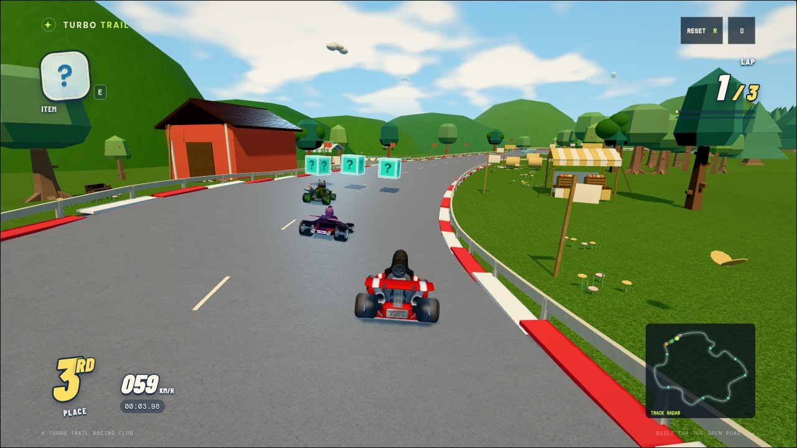
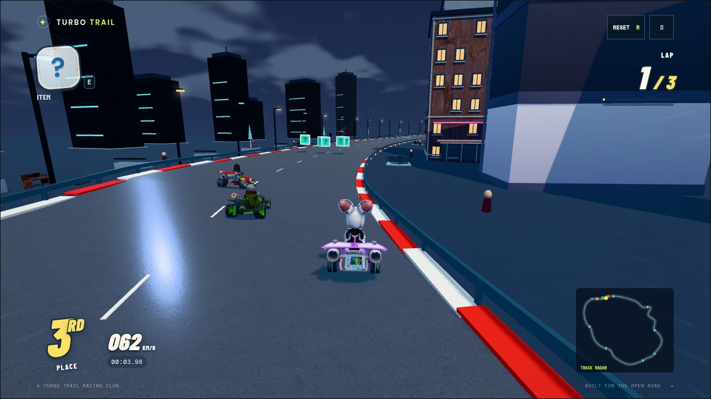
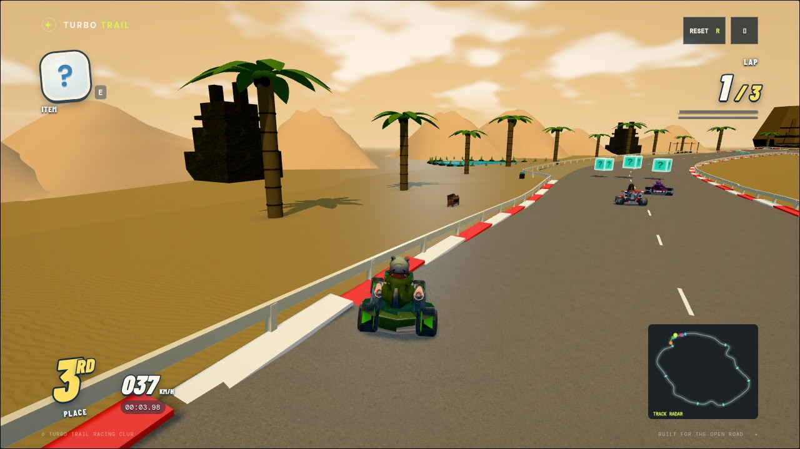
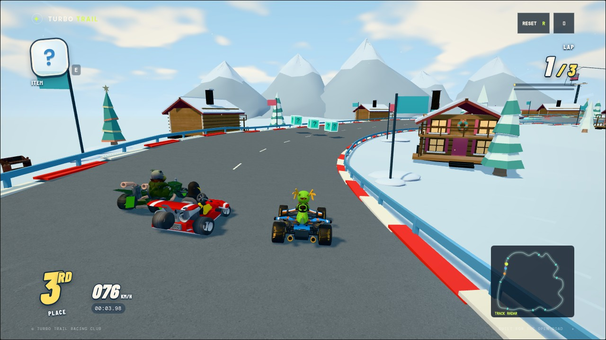

# Turbo Trail

A browser kart racer built with Three.js. Race five rivals over three laps, drift into mini-turbos, launch off ramps, and use items to take the lead.

Four courses include moving hazards, boost pads, and shortcuts: **Windmill Wilds**, **Neon Harbor**, **Sunstone Ruins**, and **Frostpeak Festival**. Supports keyboard and touch controls.

Choose from six distinct **SuperTuxKart** racers: Tux (penguin), Nolok (reptile),
Pidgin (bird), Kiki (robot), Konqi (dragon), and Wilber (mascot). Each has its
own vehicle. Choose your racer on the starting screen; the other five form
the opponent grid. [Racer artwork credits and licenses](assets/courses/packs/shared/LICENSES.md).

## Screenshots

| Windmill Wilds | Neon Harbor |
| --- | --- |
|  |  |
| **Sunstone Ruins** | **Frostpeak Festival** |
|  |  |

## Run locally

Requires Python 3 and npm to use the start command:

```sh
npm start
```

Open [localhost:5173](http://127.0.0.1:5173). Any static HTTP server also works. No install or build step is needed; Three.js, fonts, and game assets are bundled locally.

## Controls

| Action | Key |
| --- | --- |
| Accelerate | W / ↑ |
| Brake / reverse | S / ↓ |
| Steer | A / D or ← / → |
| Drift / mini-turbo | Hold Space or Shift while turning, then release |
| Ramp trick | Tap Space or Shift near takeoff |
| Use item | E / Enter |
| Pause | Esc |
| Recover at low speed | R |

Touch controls appear on supported devices; drag on the game canvas to steer.

## Tests

```sh
npm test
```

Requires Node.js. Tests cover course layouts, physics, race progress, AI, items, and asset integrity. For interactive checks, open [tests/browser.html](http://127.0.0.1:5173/tests/browser.html) while the server is running.

## Credits

Original procedural artwork and adapted CC0 assets. See [asset credits](assets/CREDITS.md), [course assets](assets/courses/LICENSES.md), and [materials and props](assets/living/LICENSES.md) for sources and licenses. Three.js and font licenses are included under `vendor/`.

For design and development details, see the [art direction](proposals/art-direction.md), [course proposal](proposals/windmill-wilds.md), and [course authoring contract](src/courses/CONTRACT.md).
For renderer ownership, reusable effect APIs, and visual checks, see [graphics tuning](docs/graphics.md).
