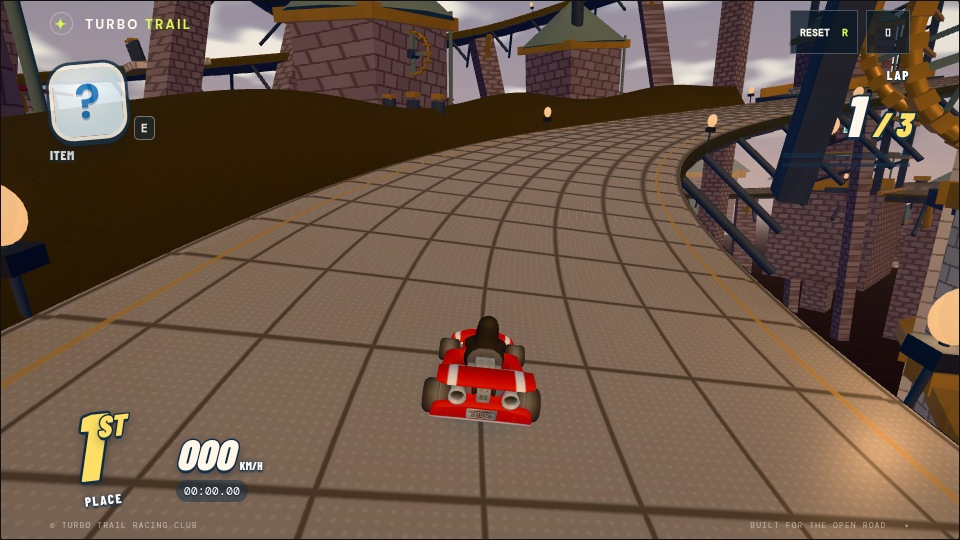
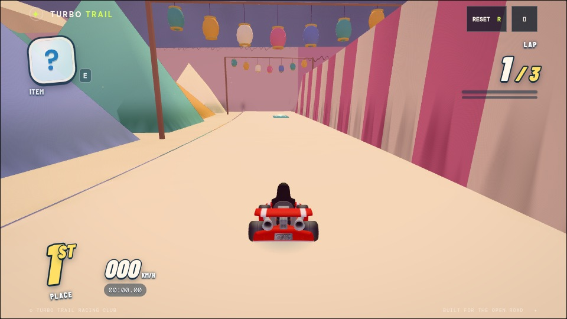
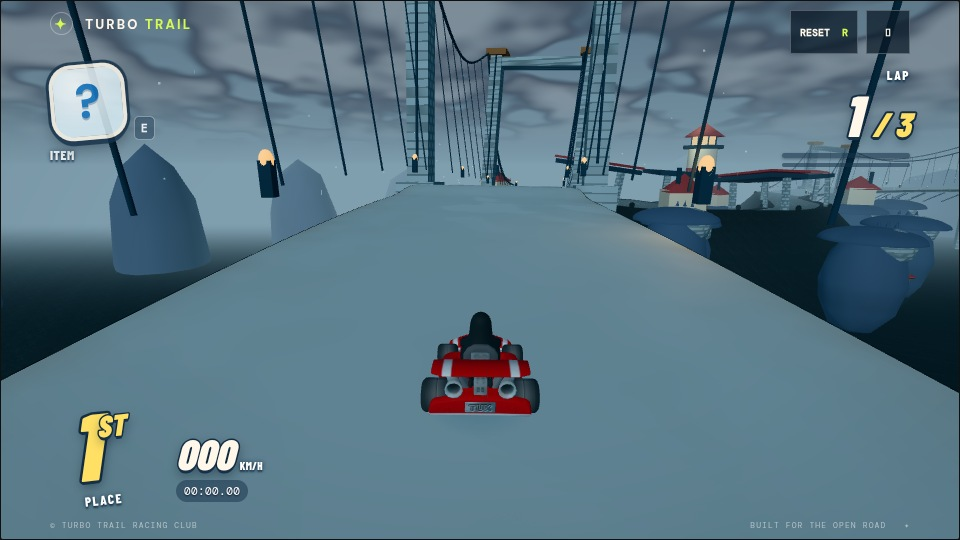
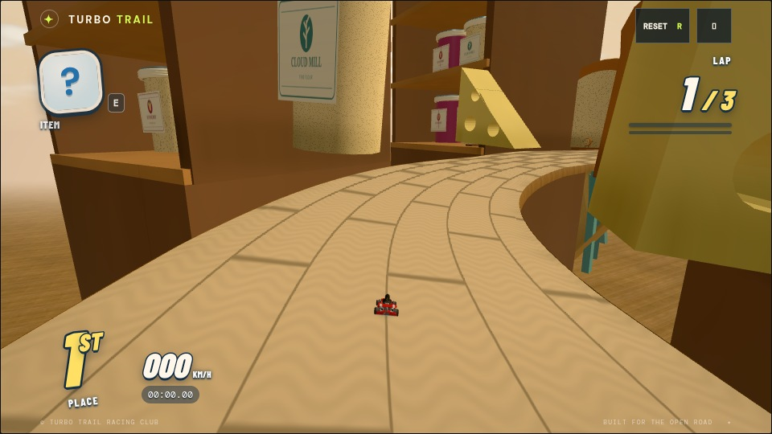
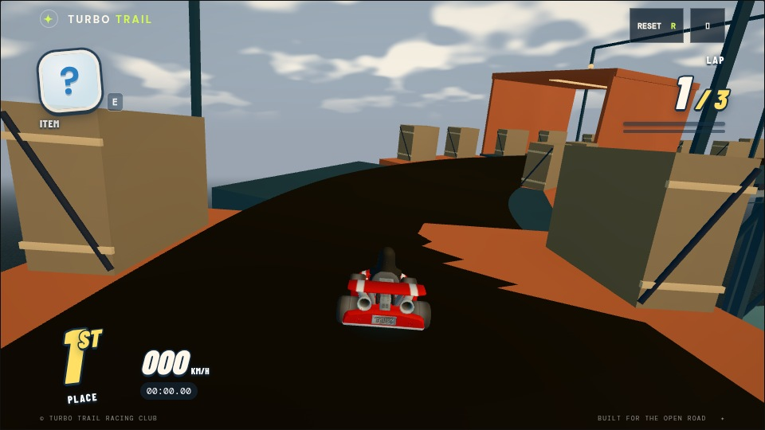
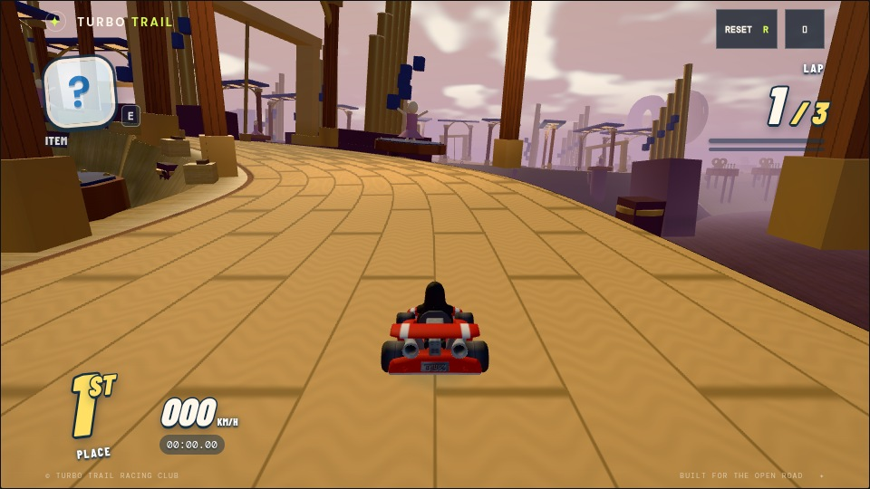
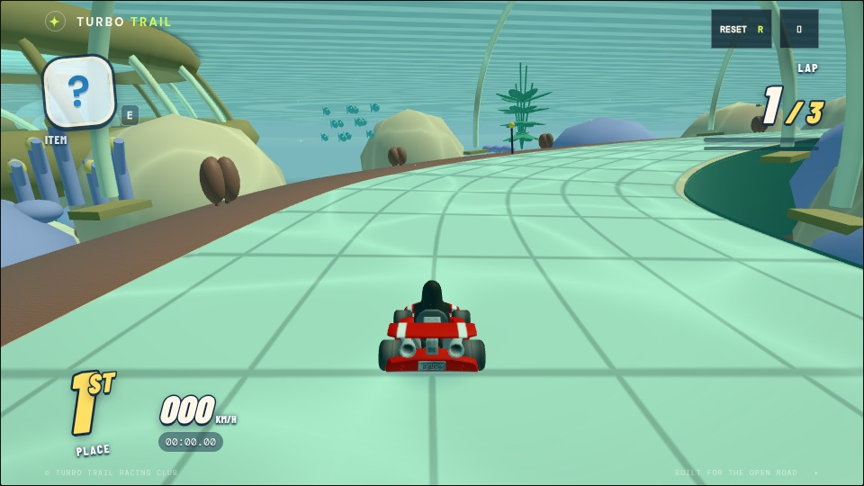
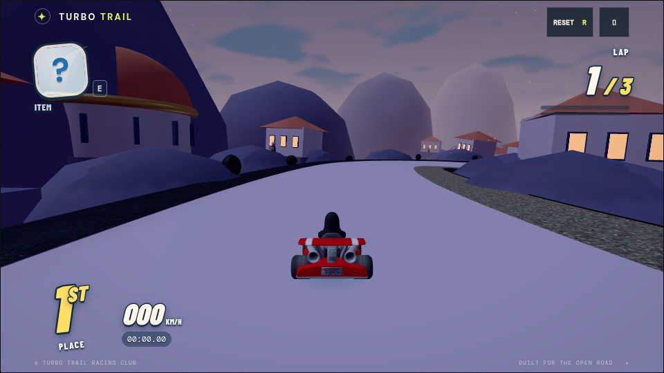

# Turbo Trail

A browser kart racer built with Three.js. Race five rivals over three laps, drift into mini-turbos, launch off ramps, and use items to take the lead.

Twelve playable courses include moving hazards, boost pads, and shortcuts: **Windmill Wilds**, **Neon Harbor**, **Sunstone Ruins**, **Frostpeak Festival**, **Clockwork Citadel**, **Paper Revel**, **Tempest Causeway**, **Pocket Pantry**, **Railstorm Express**, **Metronome Hall**, **Pelagic Glasshouse**, and **Emberwing Observatory**. Supports keyboard, touch and gamepad controls.

Course edges now come from meadows, dunes, snow, kitchen shelves, reef beds and exposed decks. Most boundaries are open: explore rough shoulders, or fall from a ledge and recover automatically onto the course. [Pathway designs for all twelve courses](docs/pathway-design.md).

Choose from six distinct **SuperTuxKart** racers: Tux (penguin), Nolok (reptile),
Pidgin (bird), Kiki (robot), Konqi (dragon), and Wilber (mascot). Each has its
own vehicle. Choose your racer on the starting screen; the other five form
the opponent grid. [Racer artwork credits and licenses](assets/courses/packs/shared/LICENSES.md).

## Screenshots

To regenerate these images, see the [screenshot capture guide](docs/screenshot-capture.md).

| Windmill Wilds | Neon Harbor |
| --- | --- |
|  |  |
| **Sunstone Ruins** | **Frostpeak Festival** |
|  |  |
| **Clockwork Citadel** | **Paper Revel** |
|  |  |
| **Tempest Causeway** | **Pocket Pantry** |
|  |  |
| **Railstorm Express** | **Metronome Hall** |
|  |  |
| **Pelagic Glasshouse** | **Emberwing Observatory** |
|  |  |

## Run locally

Requires Node.js 22+ and npm:

```sh
npm ci
npm start
```

Open [localhost:5173](http://127.0.0.1:5173). Three.js, fonts, and game assets are bundled locally; no build step is needed. A static server still supports single player, but multiplayer requires the Node server.

## Multiplayer

Choose **Multiplayer** on the main screen, enter your name, then host a room or join with its six-character code. The host can copy an invite link. Up to six players choose their characters; the host chooses any of the twelve courses and **1 or 3 laps**. Everyone readies up, then the host starts. The countdown waits for all course loads.

The server simulates every kart, collision, pickup, item, and finish at 120 Hz in an isolated worker per room. Clients predict their own driving, replay unacknowledged controls after corrections, smooth visual corrections, and interpolate opponents using an adaptive buffer. Input sends run at 30 Hz and snapshots at 20 Hz, with bounded extrapolation and slow-connection backpressure. Network delay can still affect when hits and item use are confirmed; severe outages cannot be made invisible.

In multiplayer, Esc opens a local menu while the race continues. Your kart coasts; the menu includes **Leave race**. Reconnecting or refreshing restores your racer using a private token saved in the tab. Once the race finishes, return to the room to choose another course and ready up again. Other racers have up to 60 seconds after the first finish before receiving DNF.

For friends on your network, share this machine's reachable address and port 5173. For Internet play, deploy this Node process on a server accessible to everyone, with HTTPS and WebSocket forwarding for `/multiplayer`. `PORT` and `HOST` configure the listener (defaults: `5173`, `0.0.0.0`). Rooms live in memory on one process, so restarting it clears rooms; multiple instances need sticky routing or a shared room service. A static-only host such as GitHub Pages cannot serve room connections.

## Controls

| Action | Key |
| --- | --- |
| Accelerate | W / ↑ |
| Brake / reverse | S / ↓ |
| Steer | A / D or ← / → |
| Drift / mini-turbo | Hold Space or Shift while turning, then release |
| Ramp trick | Tap Space or Shift near takeoff |
| Use item | E / Enter |
| Pause | Esc |
| Recover at low speed | R |

Touch controls appear on supported devices; drag on the game canvas to steer.

Enter a drift with a fresh drift press while turning at speed. Steer into the bend to tighten the line and charge faster; countersteer to widen it. One blue diamond beside each rear wheel means a mini-turbo is ready; two orange diamonds mean the longer turbo is ready. Release to regain grip and boost out of the corner. Charge requires sustained turning with the course bend; straight-road weaving earns nothing. taps, braking, wall scrapes, jumps and rough ground interrupt it. Let the tires recover and any mini-turbo finish before pressing again. Existing boosts and stars do not build drift charge.

## Tests

```sh
npm test
```

Requires Node.js. Tests cover course layouts, physics, race progress, AI, items, and asset integrity. For interactive checks, open [tests/browser.html](http://127.0.0.1:5173/tests/browser.html) while the server is running.

## Credits

Original procedural artwork and adapted CC0 assets. See [asset credits](assets/CREDITS.md), [course assets](assets/courses/LICENSES.md), and [materials and props](assets/living/LICENSES.md) for sources and licenses. Three.js and font licenses are included under `vendor/`.

Windmill Wilds now has eight connected places: a flower fair, root woodland, banked ridge, reedwater crossing, working mill, cider orchard, willow maze and harvest homecoming. [Course map and elevation](docs/screenshots/windmill-route-plan.png) · [Full design brief](proposals/windmill-wilds.md).

For design and development details, see the [art direction](proposals/art-direction.md), [course proposal](proposals/windmill-wilds.md), and [course authoring contract](src/courses/CONTRACT.md).
For module ownership and development conventions, see [project architecture](docs/architecture.md).
For renderer ownership, reusable effect APIs, and visual checks, see [graphics tuning](docs/graphics.md).
