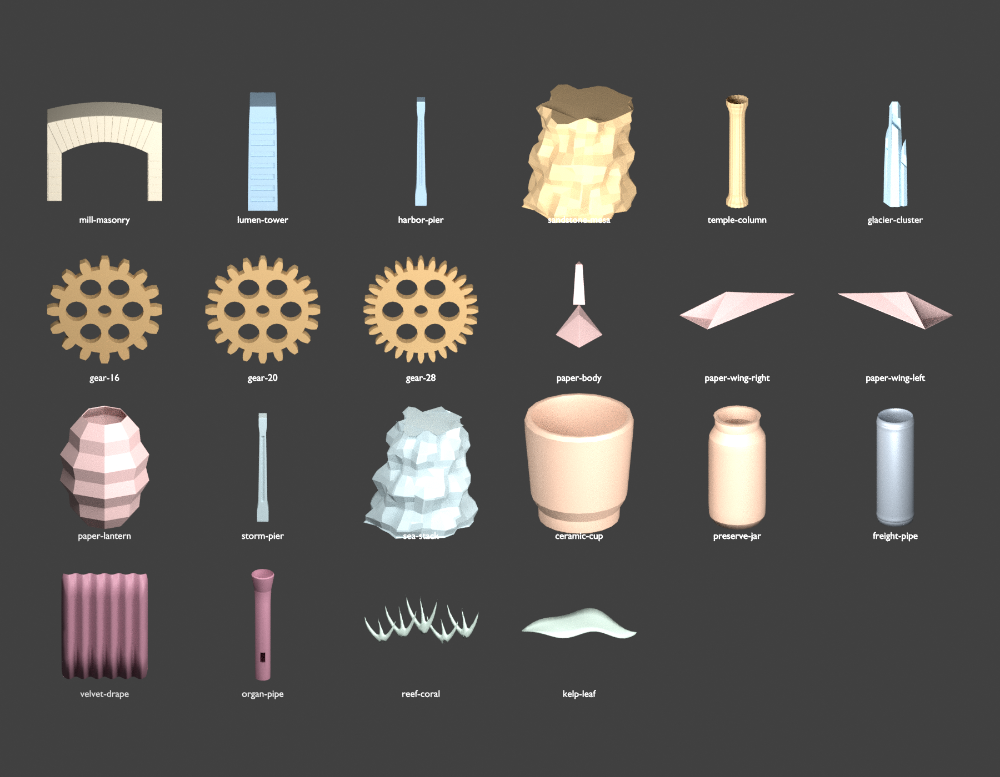
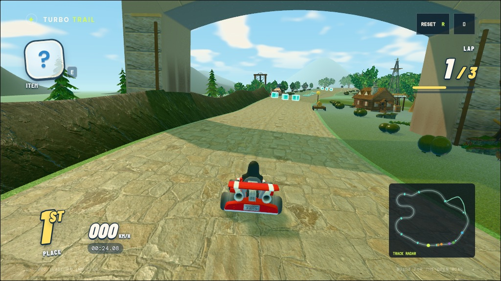

# Blender sculptures for the remaining courses

Twenty-two original GLBs replace selected scenery components in the eleven
courses beyond Emberwing. They reuse each course's materials, tint, surface
effects, placement bounds and animation pivots. Roads and changing driveable
surfaces continue to follow the simulation's track queries.

| Course | Replaced assets | How they look and feel different |
| --- | --- | --- |
| Windmill Wilds | Mill arch masonry | Staggered stone courses and radial arch stones give the gateway readable joints and softened edges. The exact Boolean opening spans the actual road and asymmetric apron. Its placement now stays over the route, fixing the clearance system's previous relocation of the gateway. |
| Neon Harbor | Lumen tower shell; bridge piers | The landmark tapers above recessed window bays. Buttressed piers have recessed service channels and bevels that catch the existing neon lighting. |
| Sunstone Ruins | Mesa outcrops; column shafts | Weathered layers, shallow undercuts and leaning silhouettes replace uniform rock blobs. Fluted columns have moulded collars and a more legible stone profile. |
| Frostpeak Festival | Glacier shards, including waterfall formations | Three joined crystals have irregular crowns, chipped diagonal faces and subtle bevels instead of single tapered hexagonal tubes. |
| Clockwork Citadel | 16-, 20- and 28-tooth gears, including watch-well gears | Involute teeth, open axle bores and six web holes create complete mechanical parts. Their solid faces and bevelled edges read as cast metal while the existing rotations remain synchronized. |
| Paper Revel | Crane bodies; left and right wings; lantern shells | Creased wings retain their separate flapping hinges. Thin solidified paper shells have defined edges; faceted accordion lanterns give the arcade a folded-paper silhouette. |
| Tempest Causeway | Tower piers; sea stacks | Buttressed, recessed piers read as structural supports. Tapered, leaning sea stacks have restrained wave-cut ledges and weathered relief. |
| Pocket Pantry | Cup bodies; preserve-jar bodies | Cups have rounded feet, thick rims and physical inner walls. Jars have rounded shoulders and recessed necks, so the giant containers feel manufactured rather than cylindrical. |
| Railstorm Express | Pipe cargo | Actual hollow shells and rolled edges make the pipe bundles readable at their exposed ends. The detailed-wheel experiment was omitted because the wheels were largely hidden during driving. |
| Metronome Hall | Velvet wall panels; organ resonators | Pinned Blender cloth relaxation produces real pleats and a varied hem. Brass resonators have flared openings and Boolean flue mouths. Cloth simulation runs only while building the asset. |
| Pelagic Glasshouse | Coral clusters; kelp leaves | Tapered Bezier branches are fused through voxel remeshing into organic joints. Curled, ribbed blades replace flattened spheres and keep their existing swaying motion. |



The sheet uses studio lighting and representative proportions to reveal the
geometry. The driving-camera screenshots in `docs/screenshots/` show the actual
course materials, lighting and surface effects. Additional course views are in
`docs/screenshots/sculptures/`.



## Integration and cost

`createAuthoredGeometryLibrary` flattens imported mesh transforms, preserves
authored normals, UVs and occlusion colors, then fits each part to its former
local bounds. Matching parts share the fitted geometry. Existing regional
batching and instancing still apply. The GLBs embed no external textures and
total about 2.27 MB; their manifests record CC0 attribution, sizes and hashes.

Retired procedural gear, crane and coral builders have been removed. Parts use
declared dimensions or bounds instead of generating reference meshes solely to
measure them; shared primitives remain where other scenery still uses them.
Geometry-only simulation fixtures use cached box placeholders when art is omitted.
All eleven exported lighting scene hashes stayed identical after this cleanup.

The full world inventory across these eleven courses grew by approximately
575,000 triangles, or 10%. Clockwork's mesh-object count fell from 831 to 616;
Pelagic's fell from 1,486 to 1,457. Individual increases vary: paper folds,
rounded containers and drapery add more geometry than the large architectural
changes. Repeated jar, drape and lantern meshes were simplified after review.
These inventory counts include all placed instances, animation geometry and
LOD variants. They are not camera-submitted triangles or a hardware FPS result.

## Rebuilding

```sh
blender -b -t 2 --python-exit-code 1 --python tools/build-course-sculptures.py
node tools/export-lighting-scene.mjs windmill-wilds neon-harbor sunstone-ruins frostpeak-festival clockwork-citadel paper-revel tempest-causeway pocket-pantry railstorm-express metronome-hall pelagic-glasshouse
blender -b -t 2 --python-exit-code 1 --python tools/bake-course-lighting.py -- windmill-wilds neon-harbor sunstone-ruins frostpeak-festival clockwork-citadel paper-revel tempest-causeway pocket-pantry railstorm-express metronome-hall pelagic-glasshouse
blender -b -t 2 --python-exit-code 1 --python tools/render-course-sculptures.py
```

Pass course IDs after `--` to build selected sculpture packs. The recipes use
exact Booleans, bevels and weighted normals, solidify, subdivision, pinned cloth,
curve tapering, voxel remeshing, displacement and decimation where they improve
the specific component. Every export receives UVs and restrained six-ray vertex
occlusion. Cloth is baked into a static mesh; no Blender modifiers run in-game.

To compare world inventories with another checkout:

```sh
COURSE_SCENE_STATS=only node tools/export-lighting-scene.mjs paper-revel metronome-hall
```

## Verification

The full suite passed 207 tests; fourteen affected tests passed again after
the final budget changes. Coverage includes imported asset hashes, finite scene
assembly, animations, driving mechanics and three-lap AI completions. New tests
check fitted bounds and pivots, preserved shading channels, gear axle bores,
end-to-end pipe openings and recessed cup floors. Lint and formatting passed.
The final Windmill regression also confirms that clearance retains both the
gateway's route-centred placement and the masonry mesh itself.

All eleven lighting bakes were regenerated and checked against their exported
scene hashes. The route-geometry audit found no intersections in ten courses.
Pelagic's 284 intersections are exactly the existing water plane at underwater
transitions, identical to the pulled baseline; none involve the new sculptures.
Driving-camera captures were checked for browser and shader errors.
