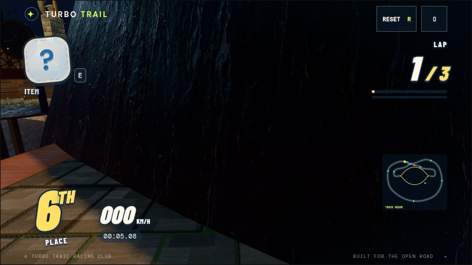
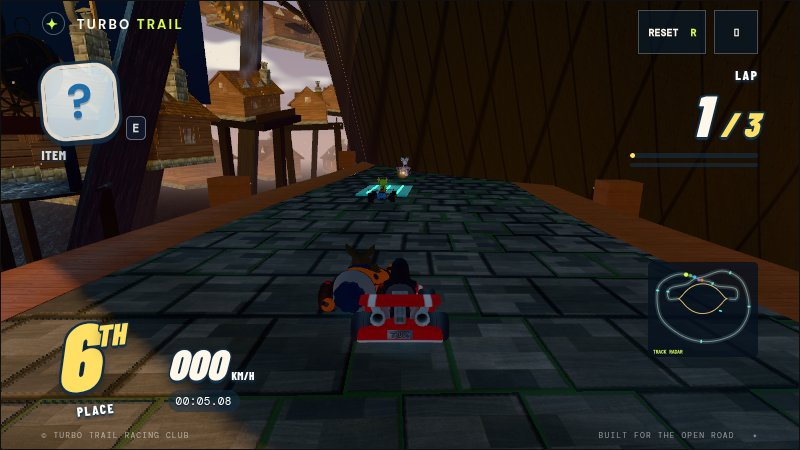
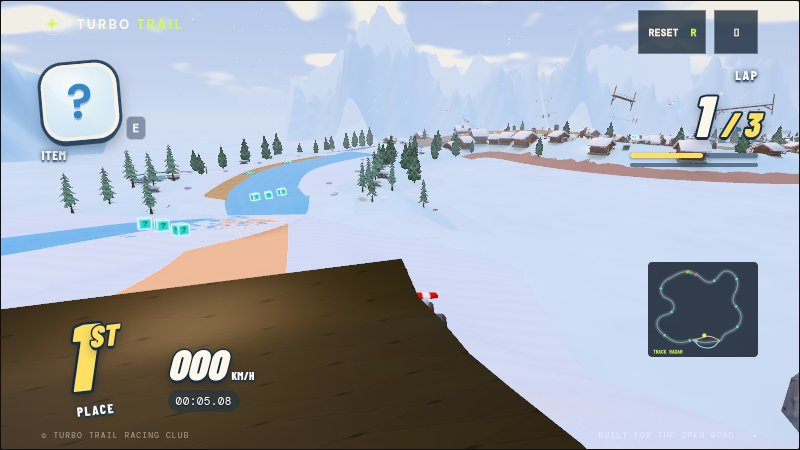
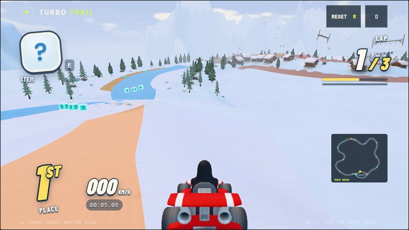
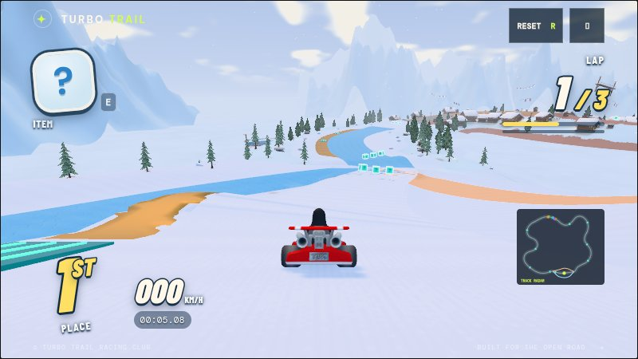

# Twelve-course playtest review — 2026-10-08

All twelve courses completed three-lap Chromium races. The visual pass inspected
347 section, alternate-route and powder views, followed by affected-course
rechecks, for 569 captured views overall. Browser runs reported no JavaScript or
rendering-console errors;
pause, resume, restart and item smoke checks passed on every course.

The simulation pass completed two seeded six-kart races per course: 144 kart
finishes and 432 laps. Each of the twelve alternate routes also received three
separate driving trials, including the human engine: all 36 rejoined without
rail impacts or recovery. Paper's valley, bridge and bank were checked on their
respective laps. A real-model geometry audit checked 44,723 lane stations across
fourteen scene states, including all three Paper layouts, with no unexpected
solid scenery in the driving/head-height corridor.

| Course | Reviewed features and resulting repairs |
| --- | --- |
| Windmill Wilds | Grove fork, boardwalk supports, stacked ridge, bridge, maze and verges. Driving and scenery checks passed. |
| Neon Harbor | Container roof fork and launch lip, conveyors, traffic bypass, bridge and waterfront edges. Checks passed. |
| Sunstone Ruins | Both moving rings, canyon, mesa, engine and courtyard. Replaced folded ring joins with broad, tangent joins; fitted roofs and suspension assemblies together with their supports. |
| Frostpeak Festival | Full downhill width, both ski runs, powder crossings, quarterpipe, lake and cabins. Unified the snow floor and driving support; removed folded faces, overlapping shoulders and misplaced downhill clutter; corrected signs, foundations, ramp approaches and chase views. |
| Clockwork Citadel | Both bowl routes, broad bowl banks, foundry, stacked ramps and high return. Excavated an upper terrain shoulder that blocked the lower foundry road and camera. |
| Paper Revel | All three lap-specific routes, folds, exposed edges, unfolding and rejoin gates. Checks passed. |
| Tempest Causeway | Shelters, flexible spans, water, wind, waves and lightning. Fitted complete supported shelters; restored aerial steering during boosted wave flights so racers can follow curved bridges. |
| Pocket Pantry | Scale portals, miniature shelves, sink, food placement, edges and return. Checks passed. |
| Railstorm Express | Boarding, moving roofs, every carriage style, couplings, ramps and disembarking. Kept complete launch ramps visible and usable over the boarding dock before their moving gaps emerge. Eight additional player race variations finished without recovery or rail impacts. |
| Metronome Hall | Hammer phases, drum gorge, landings, galleries and finale. Checks passed. Teleporting onto a closed hammer can intentionally show the hammer in front of the kart; driving checks time the crossing. |
| Pelagic Glasshouse | Underwater transition, eel grotto, coral, currents, ascent and glasshouse. Checks passed. Water-surface intersections are expected and excluded from solid-scenery audits. |
| Emberwing Observatory | Cannon departure, caldera flight and landing, cliffs, observatory and return. Checks passed. |

`npm run check` passed lint, formatting and all 222 tests. Regression coverage
includes upward-facing snow and ring triangles, rendered/physical snow heights,
powder transitions, real quarterpipe camera triangles, the Clockwork passage,
boarding-dock launches and boosted wave steering.

One Railstorm rival recovered after being hit during a coupling jump in the
seeded item race; the player completed both seeds without recovery. The recorded
[results](course-playtest-results.json) retain this combat outcome rather than
counting every fall as a geometry defect.

These were automated driving sessions plus visual inspection in software
Chromium. They verify the tested behavior and scenes; they do not measure
performance on a player's GPU or substitute for controller feel testing.
Reproduction commands and tool scope are in [course-playtesting.md](course-playtesting.md).

## Saved visual comparisons

Clockwork foundry passage:

Frostpeak powder beside the quarterpipe:

Continuous downhill snow and both side runs:

