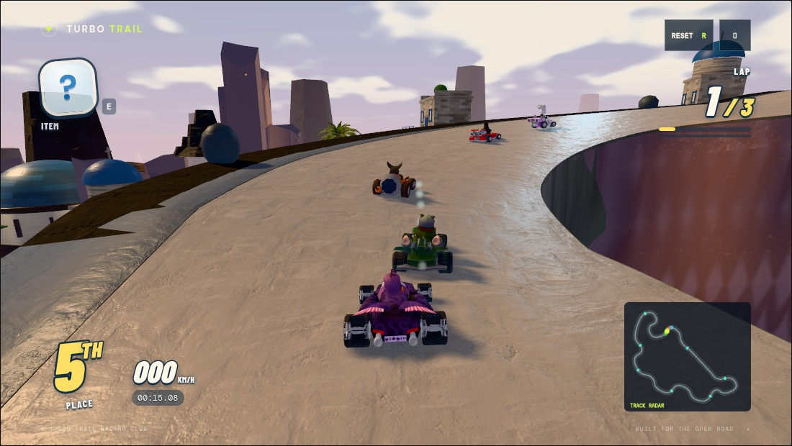
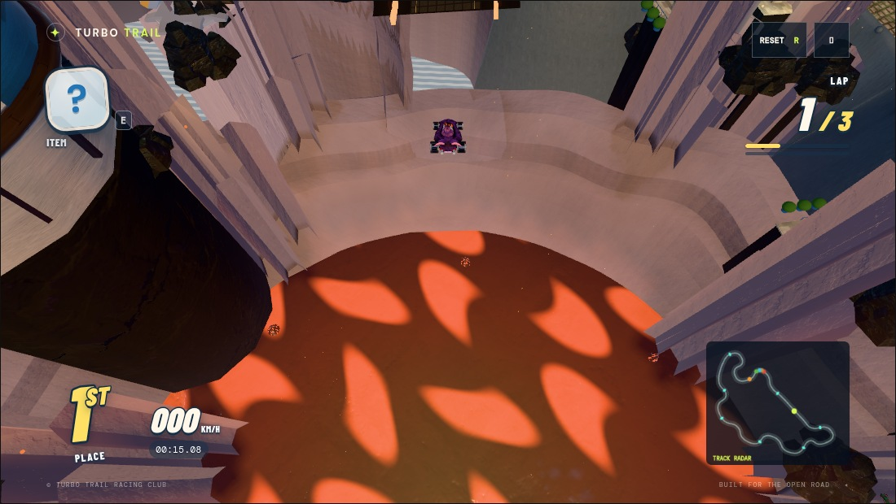

# Emberwing Blender geology

Emberwing's volcanic landscape now uses local Blender-authored GLBs. This is a
scenery migration: driving surfaces, route boundaries, cannon physics, moving
domes, lava and vents continue to use the shared simulation queries.

| Replaced scenery | Blender replacement | Visible change |
| --- | --- | --- |
| Repeated roadside rocks and cylindrical support stacks, including their small pale caps | Nine platform-following cliff spans | Continuous rock faces connect the road shoulders to the island base, with layered ledges, erosion relief and sloping talus instead of isolated supporting props. |
| Caldera torus, open cylinder wall and ring of 28 repeated rocks | Four crater quadrants | The lava shoreline rises through stratified inner walls into an irregular scalloped rim and slopes down outside. The cannon reveal exposes a connected crater rather than separate primitives. |
| Nearby `rock-tallb` outcrops in the fidelity layer | A cluster of nine cooling columns, with near/mid/far variants | Hexagonal faces, bevelled edges and broken crowns produce a columnar basalt silhouette. Distant islands keep the existing rock model. |

The cliff and crater vertex colors carry restrained strata shading. Existing
rock normal maps provide fine surface detail; the old dark albedo is omitted so
the larger forms remain readable. The course's lighting bake was regenerated
against the final scenery.





## Rebuilding

Install the repository's development dependencies, then run:

```sh
blender -b -t 2 --python tools/build-emberwing-geology.py
node tools/export-lighting-scene.mjs emberwing-observatory
blender -b -t 2 --python tools/bake-course-lighting.py -- emberwing-observatory
```

The Blender script exports current platform coordinates and cannon endpoints
through `tools/export-emberwing-layout.mjs`. It writes model hashes, exact
placements and a digest of the evaluated layout. Rebuild after changing the
course's route: the seam regression detects stale geometry. The GLBs contain
original geometry and vertex colors, with no embedded external textures.

## Geometry and verification

Sixteen exported files total about 2.13 MB and 22,464 unique triangles. Those
files comprise nine cliffs, four crater quadrants and three detail variants.
Basalt detail levels contain 1,044 / 288 / 192 triangles, switch at 110 / 240 m,
and share the existing regional instancing system. Static cliffs and crater
quadrants are separately culled and receive the existing spatial batching.

The complete static scene export grew from 234,582 to 275,002 triangles because
the reusable outcrop appears multiple times. Matching switchback and flight
captures submitted fewer draw calls, with similar triangle counts. These are
software-browser observations of particular views, including actors and render
passes; they are not a target-hardware FPS benchmark or a guaranteed speed gain.

The full-course geometry audit checked 3,420 driver/head-height rays with zero
intersections. The new regression also checks every exported cliff lip against
the actual track queries and audits the imported geology alone. Existing tests
verify three-lap AI completion, cannon snapshots/recovery, finite scenery,
asset hashes and lighting outputs. Driving-camera captures showed no browser or
shader errors; human driving feel remains a playtest judgment.
