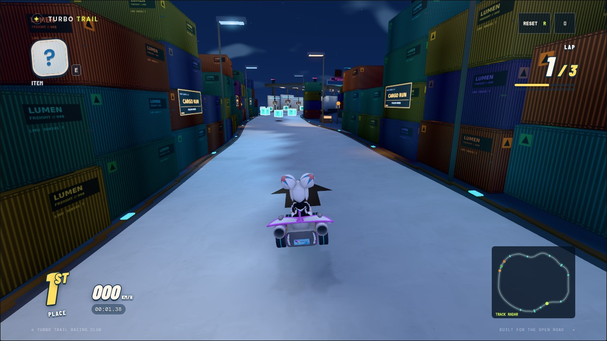
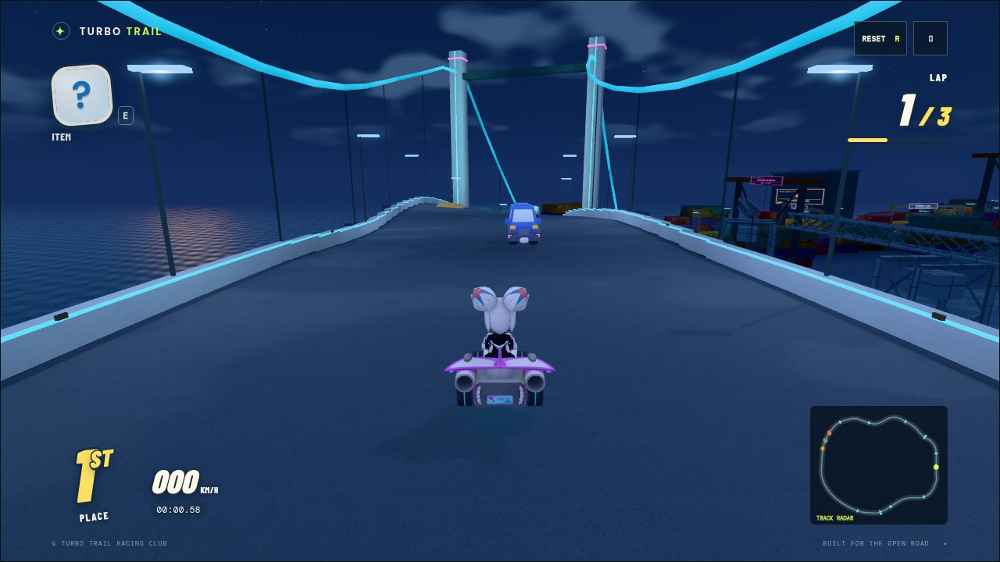
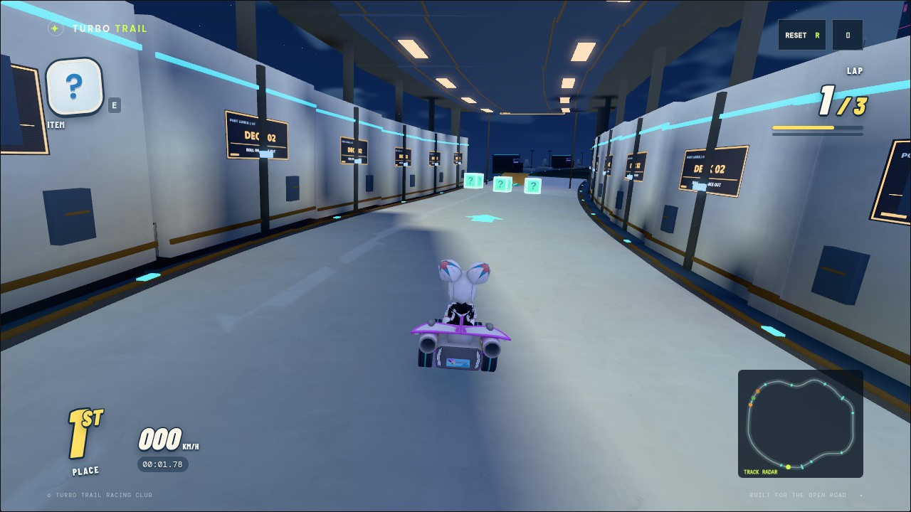
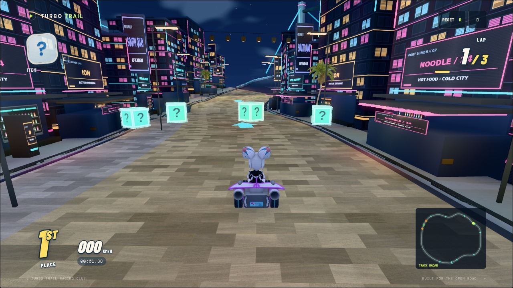
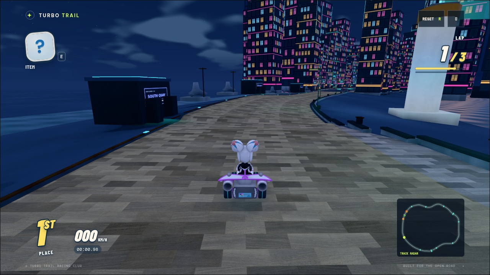

# Port Lumen course authoring

Neon Harbor now follows a 1,899 m waterfront loop with eight districts. The
minimum constructed horizontal radius is 41.4 m. Downtown reverses direction
between tall facades on both sides; the cargo district narrows to a 15.2 m
container canyon. The bridge has a straight high span over the inlet, and the
ferry deck is nearly straight, enclosed by continuous bulkheads and ceiling
modules. Three laps, bridge traffic/contact, the mandatory powered conveyor,
and the once-only second-lap ship passage remain part of the race.

The continuous rails, center dashes and racing curbs are replaced by district
boundaries: sidewalks and storefronts, container stacks, ferry hull walls,
bridge parapets and seawalls. They follow the same surface edges that physics
uses, including the service alley, market delivery apron and coastal cut.
The optional ferry-exit ramp has a 1.9 m crest and a boost approach beside the
smooth lane. All driving surfaces remain continuous.

The world runs independently of the racers: a three-car elevated train crosses
downtown, four cars use a second elevated expressway, two enclosed water taxis
travel beside the quays, three cargo gantries lift containers, and cooling fans
rotate above the freight district. Existing water, cargo shuttle, crane hooks,
lighthouse beam and bridge traffic also animate. Scenery contains no characters.

## Materials and assets

The eleven offline WebP maps total approximately 443 KB. Three facade families have
separate emissive masks, lit/unlit interiors, blinds, mullions, shutters and
small utility details. One shared sign atlas supplies sixteen advertisements
and wayfinding panels. A neutral corrugated-metal map is tinted for five cargo
families. The welcome gantry and conveyor use separate maps. A shop-window atlas adds
stocked bottle shelves, bowls and battery cabinets behind recessed glass.

Seven imported Kenney CC0 models add taxi/sedan/van/truck/delivery silhouettes
and two skyscraper families. All files are local at runtime. Licenses, pinned
source URLs, sizes and SHA-256 hashes live in the course pack manifest.

Repeated static meshes are regionally instanced/batched; moving assemblies are
protected from flattening. Dim gradient cards supplement the existing three
racer lights. The 768-pixel offline BVH lighting bake supplies terrain occlusion
and diffuse bounce. Neon Harbor also uses a 1024 × 768 spill atlas: twelve
256-pixel XZ slices from -2 to 75 m, interpolated in the material shader with two
texture samples. All 337 static emitters are visibility-tested against the real
scene during baking, so container faces, bulkheads and upper facades receive
colored light without additional runtime shadow-casting lights. The extra atlas
is approximately 151 KB on disk and 3 MiB on the GPU, without mipmaps.
The bake exporter reads the atlas albedo averages as well as imported textures.

The night palette keeps a dark sky with brighter blue-violet hemisphere fill and
rim light. Downtown has cyan/pink shop spill and warm display windows; the market
uses amber canopy lamps; cargo alternates cool floodlights and amber work lamps;
the ferry has warm ceiling bars and cool bulkhead fixtures. Bridge lamps and
landmark uplights reveal silhouettes. Road roughness varies between mostly matte
pavement and sparse puddles, softening broad white highlights. Interior fill
stays close to exterior fill so the ferry remains readable. The market and
seawall use the existing paving texture instead of the mossy rock scan. Water
Fresnel tint now runs after normal construction and before physical lighting,
fixing the shader compilation error that hid the animated harbor water.

## Driving views












## Editing

- Route, widths, ramps and mechanics: `src/courses/neon-harbor.js`.
- Close districts and natural boundaries: `build-lumen-districts.js`.
- Waterfront, props and imported towers: `build-lumen-quays.js`.
- Ambient transport and machinery: `build-lumen-motion.js`.
- Shared texture materials and sign atlas UVs: `lumen-materials.js`.
- Bridge, ferry, welcome, lighthouse and ship event: `build-port-landmarks.js`.
- District fixtures and bake emitters: `build-port-lighting.js`.

All builders live under `src/courses/neon-harbor/` and place from constructed
track frames. The `edgeStyle: "port-lumen"` option suppresses the shared generic
rail/curb furniture for this course. Other courses retain their own boundaries.

Rebuild maps/imports with `python3 tools/prepare-port-lumen.py` (Pillow/numpy).
Rebuild lighting after geometry or route edits:

```sh
node tools/export-lighting-scene.mjs neon-harbor
blender -b -t 2 --python tools/bake-course-lighting.py -- neon-harbor
```

The same-origin `test-seek` preview protocol snaps the chase camera to its new
district, allowing screenshot capture without an interpolated trip through
intervening buildings.
