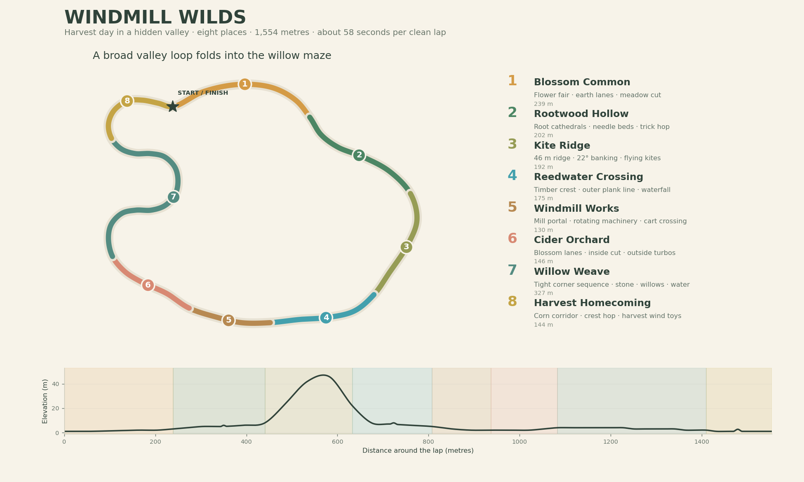
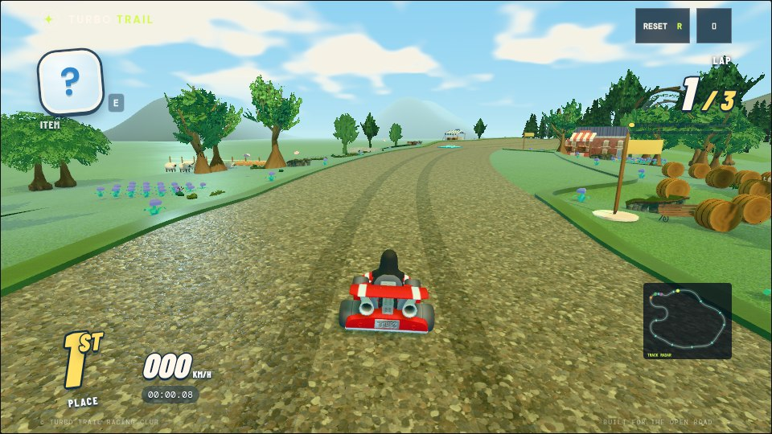
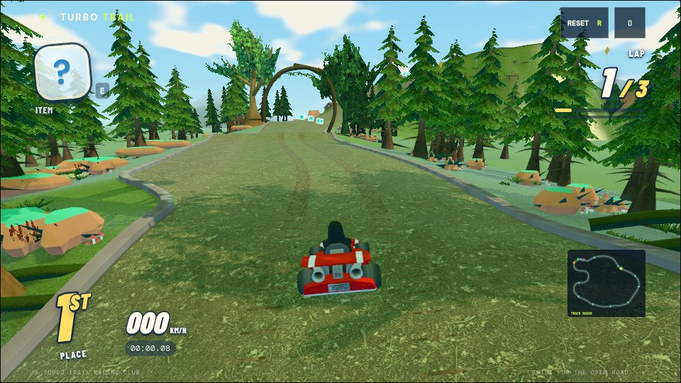
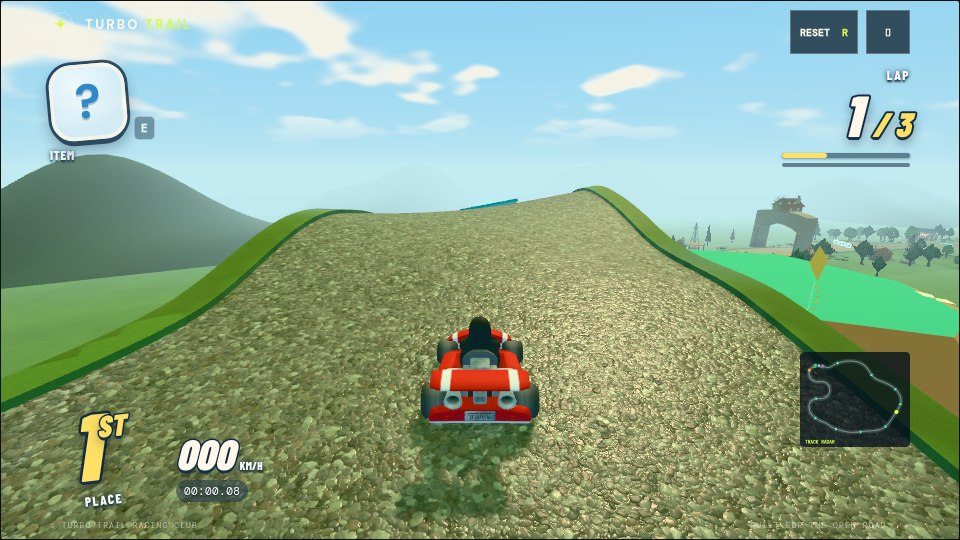
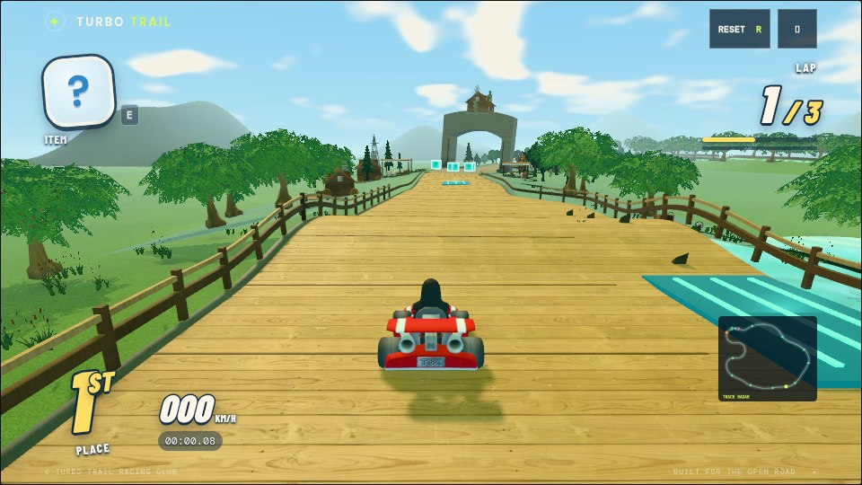
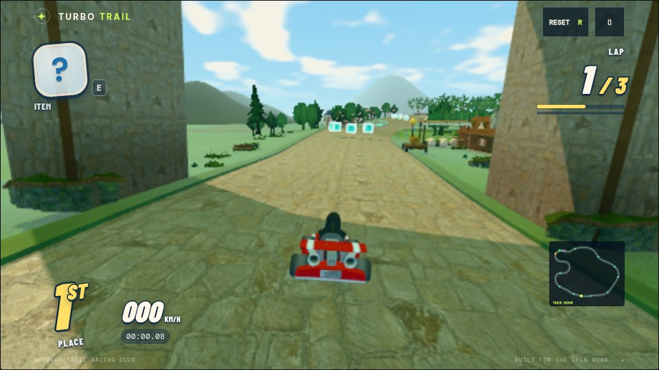
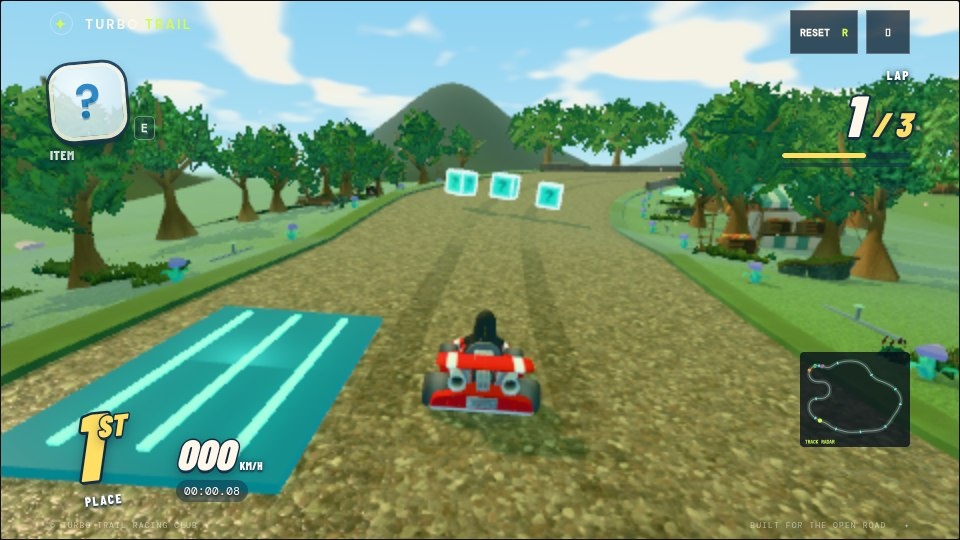
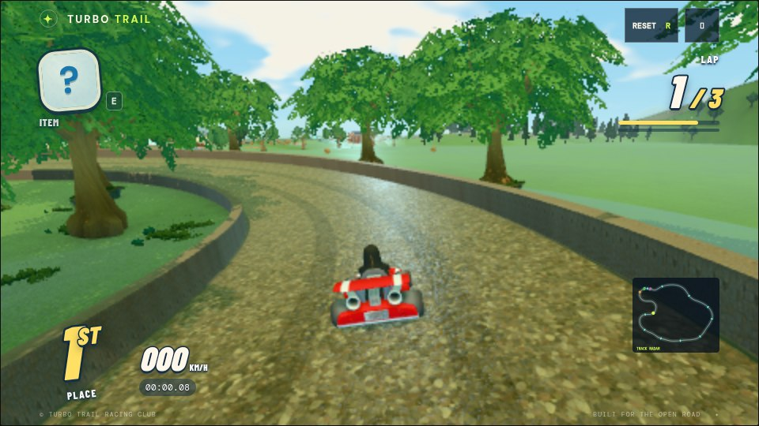
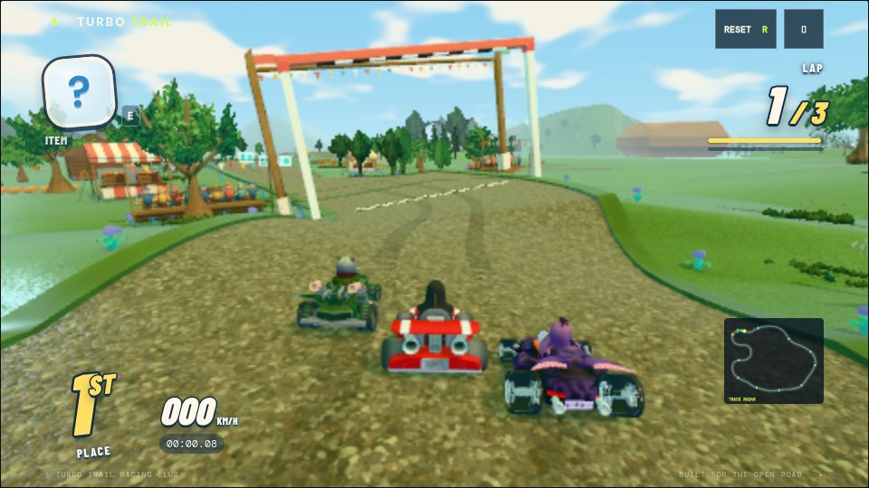

# Windmill Wilds — harvest day in a hidden valley

Windmill Wilds should feel like discovering a small countryside community while racing through it. The fair, forest, spring, mill, orchard and irrigation channels belong to the same landscape. Wind turns the machinery, carries blossom, lifts kites and bends the crops. The mill processes what the fields grow; its deliveries end up at the fair you return to.

This revision implements **eight connected places across approximately 1,554 metres**, replacing the six-section fenced asphalt loop. The actual route includes a 46 m ridge, approximately 22° maximum banking, a supported timber crossing with a wider optional plank line, and a compact sequence of rounded right-angle turns through willows and stone walls. The shortest centreline bend is approximately 19.8 m in radius. The course uses the existing kart handling; the tight corners are deliberately driven more slowly.

The design principle is **a view should also explain a driving decision**. Roots announce forest enclosure. Flags and kites announce exposed wind. Reeds advertise the boardwalk alternative. Orchard trees and pennants frame a grass cut. Stone walls show the willow maze's coming corner. Corn briefly encloses the harvest approach before it opens onto the fair. Every section has four authored elements, but the important element is its rhythm.

“Every pixel meaningful” means layering useful near, middle and far information: readable ground in front of the kart, activities and landmarks beside it, and a valley silhouette beyond. Detail should form coherent clusters. A pumpkin beside a crop bed and loading shed tells more than a random prop scattered onto a verge. The driving line still needs enough visual breathing room to read the next corner.

## The lap

The times below are measured first-lap sector durations from isolated rivals, without combat or pack collisions. Routes, textures, props and animations described in the table are implemented.

| Place | Length / approximate time | Driving character | Four distinctive elements |
| --- | --- | --- | --- |
| **1. Blossom Common** | 239 m / 9.7–9.8 s | Wide, confident acceleration into a village fair; forgiving earth lanes with room to pick an item line. | Flower and crop quilts; roadside market tents and moving festival fabric/crowds; a boost-dependent meadow expansion; farm cottages and sheep pasture completing the opening vista. |
| **2. Rootwood Hollow** | 202 m / 7.5–7.6 s | Cool enclosure, linked bends, needles under the tires, a small trick hop. The view contracts before the ridge reveal. | Two giant oak-and-root cathedrals over the race line; clustered ferns, mushrooms and mossy fallen logs; an inside needle-bed extension with a different grip/drag cost; drifting motes and forest canopy motion. |
| **3. Kite Ridge** | 192 m / 6.5–6.7 s | Climb to 46 m, lean into the hillside, glimpse the valley, then descend. Stronger tilt changes the feel of a moderate turn. | Up to approximately 22° of banking; independently swaying kites with tails and tethers; textured limestone outcrops and a viewing terrace; a gravel line and a crest boost framed by circling birds. |
| **4. Reedwater Crossing** | 175 m / 6.1–6.3 s | Narrow main timber deck, supported crest hop, optional wider outer boardwalk. Choose precision or a wider boosted line. | Visible cross-planks and trestles; an outer plank extension with its own boost pad; a limestone spring and animated waterfall sheet; boats, duck families, fishing docks and reed beds at the lake. |
| **5. Windmill Works** | 130 m / 4.9–5.0 s | Ground texture changes to stone; race through the windmill arch and read the cart crossing before the orchard opens. | Tall masonry drive-through portal; spinning iron rotor and working waterwheel/gears; a loaded delivery cart with a timed warning and a permanently clear left lane; textured farm buildings, pallets and dry-stone working yards. |
| **6. Cider Orchard** | 146 m / 5.4–5.5 s | Descending warm earth lane with a short inside grass cut and competing outside boost pads. Decide whether to spend a mushroom or keep it. | Rows of fruit trees; visible blossoms and drifting petals; the broad grass shortcut with readable entry/exit; an outside three-pad line near cottages and flower gardens. |
| **7. Willow Weave** | 327 m / 12.0–12.3 s | The longest section contains several smaller beats: a stone corridor, a turn reveal, a reversal and another bend. Rounded right-angle turns make you feel lost between things while the next lane remains readable. | A folded route with repeated tight corners; continuous textured stone boundaries close to the kart; tall willow stands with moss/fern gardens; a flowing irrigation channel visible through the inside openings. |
| **8. Harvest Homecoming** | 144 m / 5.4–5.6 s | Corn encloses the early approach, a larger supported crest invites a trick, then the road releases into the wide opening fair. | Tall corn corridors and swaying crop materials; a 1.7 m authored crest ramp; pumpkin-and-wheat beds, hay stacks and produce lodges; spinning little harvest wind toys and an optional grass-side line. |

## How it should look and feel

### Blossom Common: welcome, motion, invitation

Use cream canvas, coral pennants, violet flowers and golden wheat against spring green. The fair is a gathering of stalls, farm houses and planted strips rather than an empty starting straight. Wheel ruts replace centre dashes. Broad striped harvest parcels and hay bales fill middle-distance views; their soil and stubble rows use flat batched strips rather than thousands of distant crop models. Small flower banks indicate the road's flow without enclosing it in metal. Spectators and festival fabric make the place active before the racers arrive.

The meadow expansion is an invitation to experiment early in the lap. Its entry and exit remain visible. It is rough grass rather than free extra asphalt, so a saved mushroom has a purpose. Flower beds outside the physical edge give the cut a visual boundary.

### Rootwood Hollow: the landscape becomes architecture

The two signature tree pairs braid thick roots above the road. Their trunks stand outside the racing space; their crooked branches and inverted ferns form a canopy over the racer. The root arches retain roughly 17–19 m overhead clearance, while the main mill portal retains its existing high clearance. No tunnel ceiling relies on the kart camera clipping through it.

Keep mushrooms and fallen timber in believable understory clusters. The forest has warmer brown/green ground and a tighter silhouette than the meadow. A small hop breaks the turn sequence without becoming a mandatory large jump. The forest floor extension invites a more adventurous line, while motes and wind animate the enclosure.

### Kite Ridge: compression becomes a reveal

The forest's close foliage releases into open sky. The road climbs to a substantially higher crest than before; the racer sees the larger landscape and approaching water. Curve-based banking increases here, with smooth transitions between sections and before off-road openings. The exposed height and leaning road carry the spectacle.

Kites establish wind without another combat hazard. Their placement outside the road allows independent sway; bird circles and limestone clusters complete the sightline. Preserve open gaps between outcrops so the view does not become a wall of props.

### Reedwater Crossing: two textures of speed

The main line is timber on actual support beams. Cross-plank seams make movement legible, the crest gives a trick opportunity, and reeds soften the shoreline. The outer plank extension stays continuous with the race surface and uses the same progress checkpoints. Its boost pad rewards the wider line. It is a playable lateral route, rather than a decorative pier.

A waterfall sheet scrolls its texture between low-poly rock forms. Duck families slowly circle, rowboats bob, and docks show fishing activity. These continue on the shared race clock regardless of racer proximity. The water shader supplies ripples and Fresnel response without real-time planar reflections.

### Windmill Works: understand the valley by passing through its machinery

The main mill arch is the course's constructed centerpiece. The loaded cart, pallets, hay, smaller pumps, waterwheel and transmission gears explain what the building does. The player races through a working place, rather than past an isolated windmill ornament.

The cart remains the interactive timed obstacle. Its warning, visible load and permanently clear left passing lane make the decision readable. It starts moving after the race's opening period, and its cycle means later visits can require a different line. It never forces waiting.

### Cider Orchard: an item decision inside a beautiful place

The orchard is a release from masonry into blossoms and earth. Imported textured tree crowns, flower borders and falling petals differentiate it from the forest. The inside grass opening now reaches its authored full width even when the section is short; taper distances adapt to the available route length.

Give the player two reasons to remember this bend: a mushroom for the grass cut, or the three outside pads for the normal line. The natural scenery shows both choices, and the shortcut rejoins before the willow maze.

### Willow Weave: the requested feeling of being inside the world

The new western route folds into several curved right-angle turns. Stone walls sit on the shared physical edge; the camera looks down one lane and discovers the next around a bend. Willow crowns, moss gardens and water glimpses make the walls feel like rural infrastructure. The maze is a technical driving sequence, with room after it to recover.

The route has roughly 19.8 m minimum centreline radius. This is a deliberate course-specific exception to the old 40 m floor; it does not lower the floor for other courses. It uses narrow 12.8 m nominal lanes, existing braking/steering and ordered progress. The rival driving checks show the bends are negotiable without boundary contacts.

### Harvest Homecoming: enclosure, hop, release

Corn plants briefly make a corridor, then open into produce lodges and the flower fair. This is a small theatrical finish: the world closes around you, you crest, then you are welcomed back. Pumpkin rows, golden grain and moving wind toys relate directly to the mill's delivery story.

The authored 1.7 m crest is larger than the former small final bump, but the existing bounded jump physics still governs flight. It remains supported ground beneath the kart; the current implementation does not introduce gap jumps, gliding, airborne steering or multi-level road projection.

## Variety between visits

The layout is learnable. Freshness comes from changing racing lines, item availability, other racers and independent environmental timing:

- The cart crossing has its own warning/movement cycle and starts after the introductory period.
- Boats, duck families, kites, wind toys, waterwheel, flags, petals, motes and birds animate from the race clock. Pausing freezes that clock.
- Reeds and crop materials use the existing GPU foliage sway, with no per-frame mesh rebuilding.
- Meadow, forest floor, ridge gravel, orchard grass, the outer plank line and the harvest-side grass offer different choices. Rough extensions retain grip/drag costs; the wooden extension is explicitly driveable.
- Corners, item lanes, crests and pads interrupt the long willow section, and each demanding enclosure opens into recovery space.

The current course does not randomly relocate corners between laps. It also does not change weather, season or track topology during a race. Those would require additional gameplay authoring rather than being described as already working.

## Assets and inexpensive graphical techniques

Four additional models were downloaded from the public Kenney Nature Kit mirror: `flower-purpleb`, `crops-wheatstageb`, `crops-cornstagec` and `crop-pumpkin`. They total approximately **61 KB**. Their manifest entries record the download URL, CC0 license, size and SHA-256. Source: [Kenney Nature Kit](https://kenney.nl/assets/nature-kit), mirrored in [Hidencod/tge-assets](https://github.com/Hidencod/tge-assets).

The existing SuperTuxKart library supplies textured trees, willows, ferns, cottages, farm houses, boats, reeds, hay, pallets, stonework and machinery. Its existing attribution/share-alike evidence remains in the pack's `licenses/` folder. This revision does not change those licenses. Existing ambientCG 1K color maps and 512 px normal/roughness maps supply grass, forest floor, gravel, wood, stone and other surfaces.

The root arches are original low-poly tube geometry. Kites, ducks, wind toys, plank supports and water-channel geometry are original procedural constructions. Most additional crops and flowers repeat the same meshes/materials and become regional instances. Distant trees retain the existing authored LODs. The world keeps its regional batching and camera-driven culling.

A new **768×768 offline lighting bake** uses actual placed scene triangles, 12 cosine-hemisphere visibility rays per texel, obstruction and local diffuse color bounce. Direct sunlight is excluded to avoid duplicating the runtime shadow. Both the indirect-light/AO image and the encoded height image are bundled with provenance and output hashes. The root arches and maze walls benefit from this inexpensive grounded shade. The bake was regenerated after the route and scenery changes.

The waterfall uses one scrolling texture, and the irrigation water shares the existing water shader. No new real-time lights, physics bodies for every crop, planar reflection render targets or volumetric effects were added. A shader-order issue discovered while viewing the new water was fixed: Fresnel tint is applied after the surface normal exists.

## Measured checks and remaining tuning

Five isolated rival drivers, skills 0.72–0.92, completed three laps with **zero boundary impacts**. Their first laps measured approximately **57.5–58.6 s**, and three-lap finishes approximately **171–174 s**. The course length measured approximately **1,554 m**. These measurements include the normal supported ramps and pad pickup logic, with no items attacking the drivers and no pack collisions. They are evidence of basic playability, not a human time-trial record.

The shared validator now accepts six through eight sections. Courses may explicitly author a minimum radius between 18 and 40 m; courses without an override retain 40 m. Stronger banking has smooth section transitions and flattens before expanded routes open. The shortcut taper adapts to short spans. Driveable plank extensions are distinguished from rough off-road patches, while karts and shells retain shared physical boundaries.

Human playtesting should next assess the maze's drift rhythm, readability of natural edges at speed, the outside boardwalk's time/reward balance, and clutter around item rows. All 97 automated tests and ESLint passed. Formatting checks passed for the changed JavaScript files; the repository-wide formatting command still reports five existing files outside this change. CPU-rendered browser screenshots do not establish a hardware frame-rate target; the design relies on batching, LOD, shared maps and baked light to contain cost.

## Further ideas worth a separate gameplay pass

The strongest next invention is **wind that changes the useful line, rather than randomly damaging the kart**. A readable gust could push a textile mill chute into a temporary ramp position, while kites and spinning vanes announce the change in advance. A second possibility is a seasonal reed ferry that creates a short supported route when docked. A third is a harvest cart that spills hop-sized hay bundles along an announced lane, offering a trick opportunity instead of only punishment.

These are brainstormed extensions, not part of this implementation. True deck branches at different heights, a changing ferry route or a physical moving ramp need height-aware route projection, shared AI/item collisions and explicit checkpoints before they are playable. The current eight-place course provides a complete continuous foundation for those larger mechanics.

## Captured course views

Live browser captures from the updated course. The first four use full rendering resolution; the last four use half resolution to accommodate the software renderer. These are visual checks, not frame-rate benchmarks.

| Blossom Common | Rootwood Hollow |
| --- | --- |
|  |  |
| **Kite Ridge** | **Reedwater Crossing** |
|  |  |
| **Windmill Works** | **Cider Orchard** |
|  |  |
| **Willow Weave** | **Harvest Homecoming** |
|  |  |
